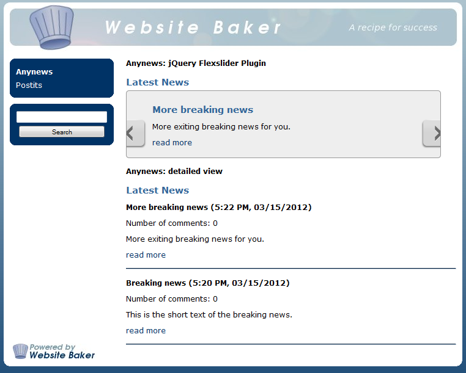

# cwsoft-anynews module for CMS WebsiteBaker 2.8.x
The code snippet `cwsoft-anynews` (short form Anynews) is designed to fetch news entries from the [WebsiteBaker CMS](http://www.websitebaker2.org) news module. Invoke the cwsoft-anynews function where you want the news output to appear on your frontend. Optional configuration parameters, HTML templates, content placeholders and CSS definitions allows you to style the news output the way you want. The cwsoft-anynews snippet ships with four templates - including two jQuery sliding effects - ready to use out of the box.

Power users define their own placeholders containing information extracted from the short and/or long news module description. Mastering cwsoft-anynews is possible - but requires you to study the information provided in the section [Customize](https://github.com/cwsoft/wb-cwsoft-anynews#customize).

## Download
You can download an archive of the latest development branch of the `cwsoft-anynews` module using GitHubs [ZIP button](https://github.com/cwsoft/wb-cwsoft-anynews/archive/master.zip). The archives of previous module releases can be found in GitHubs [Tags section](https://github.com/cwsoft/wb-cwsoft-anynews/tags). The development history is tracked via [GitHub](https://github.com/cwsoft/wb-cwsoft-anynews/commits/master).

***Please note:*** The archives downloaded from GitHub are not ready for installation in WebsiteBaker, as GitHub includes the archive subfolder. To create a working WebsiteBaker installation archive, unpack the downloaded archive on your local computer and zip the contents of the folder ***cwsoft-anynews*** (without the folder itself). Alternatively download an installable archive from the WebsiteBaker [module section](http://addons.websitebaker2.org/pages/en/browse-add-ons.php).

## License
The `cwsoft-anynews` code snippet is licensed under the [GNU General Public License (GPL) v3.0](http://www.gnu.org/licenses/gpl-3.0.html).

## Requirements
The minimum requirements to get cwsoft-anynews running on your WebsiteBaker installation are as follows:

- WebsiteBaker ***2.8.2*** or higher (recommended last stable 2.8.x version)
- WebsiteBaker news module
- PHP ***5.2.2*** or higher (recommended last stable PHP 5.4.x version)
- Optional: small modification of your template file to enable jQuery support

## Installation
1. download archive from [GitHub](https://github.com/cwsoft/wb-cwsoft-anynews/archive/master.zip) or [WB repository](http://addons.websitebaker2.org/pages/en/browse-add-ons.php?id=0C80D11) (steps 2-3 only needed for GitHub archive)
2. unpack the archive on your local computer
3. zip the contents of the folder ***cwsoft-anynews*** (without the folder itself)
2. log into your WebsiteBaker backend and go to the `Add-ons/Modules` section
3. install the newly zipped archive via the WebsiteBaker installer

### Enable jQuery support (optional)
If you want to use JavaScript effects or jQuery plugins with cwsoft-anynews, you need to add one code line to your frontend template. Open your WebsiteBaker frontend template file ***index.php*** in the [cwsoft-addon-file-editor](https://github.com/cwsoft/wb-cwsoft-addon-file-editor#readme) and search for the following lines. 

	if (function_exists('register_frontend_modfiles')) {
		register_frontend_modfiles('css');
		register_frontend_modfiles('js');
	}

Change the code lines above as follows:

	if (function_exists('register_frontend_modfiles')) {
		register_frontend_modfiles('css');
		register_frontend_modfiles('jquery');
		register_frontend_modfiles('js');
	}

If you can't find the code above in the index.php of your template, simply add the last code block to the end of your &lt;head&gt;&lt;/head&gt; section.	
	
## Usage
As `cwsoft-anynews` is designed to fetch news items from the WebsiteBaker news module, you need to add some news entries with the news module **before** you can use cwsoft-anynews. If no news are available, the message "No news available yet" is shown. Follow the steps below to add some news entries with the WebsiteBaker news module.

1. log into your WebsiteBaker backend and go to the `Pages` section
2. create a new page or section of type `News` (set visibility to None)
3. add some news entries (2-3) from the news page in the WebsiteBaker backend

### Use Anynews from a page or section
Create a new page or section of type `Code` in the WebsiteBaker backend and enter the following code to it.

	OUTDATED (SINCE V2.8.0):
	if (function_exists('displayNewsItems')) {
		displayNewsItems();
	}
	
	RECOMMENDED (FROM V2.8.0 ONWARDS):
	if (function_exists('getNewsItems')) {
		echo getNewsItems();
	}

The cwsoft-anynews output is only visible at the pages/sections of your frontend, which contain the code above.

### Use Anynews from your template
To display news items at a fixed position on every page of your frontend, open the ***index.php*** file of your default frontend template with the [cwsoft-addon-file-editor](https://github.com/cwsoft/wb-cwsoft-addon-file-editor#readme). Then add the code below to the position in your template where you want the news output to appear.

	OUTDATED (SINCE V2.8.0):
	<?php
		if (function_exists('displayNewsItems')) {
			displayNewsItems();
		}
	?>

	RECOMMENDED (FROM V2.8.0 ONWARDS):
	<?php
		if (function_exists('getNewsItems')) {
			echo getNewsItems();
		}
	?>
	
Visit the frontend of your website and check the cwsoft-anynews output. 

Depending on the Anynews function parameters defined, the output may look as follows.

 

### Use Anynews from a Droplet
Anynews v2.8.0 contains an option, which allows you to call the Anynews function from a Droplet inside your WYSIWYG editor or template more easily. Anynews parameters can be passed by the Droplet in any order. To create your own Anynews Droplet, follow the steps below.

1. create a new Droplet called `getNewsItems` via WebsiteBaker Admin-Tools --> Droplets
2. enter the following code into the Droplet code section

		if (! file_exists(WB_PATH . '/modules/cwsoft-anynews/droplet/cwsoft-anynews-droplet.php')) return;
		include(WB_PATH . '/modules/cwsoft-anynews/droplet/cwsoft-anynews-droplet.php');
		return $output;
	
Now you can use the Droplet from your WYSIWYG editor or template file by entering:

	[[getNewsItems?group_id=1,2&display_mode=4]]

***Note:*** The Anynews Droplet supports all Anynews parameters (except the rarely used parameter 'custom_placeholder').

## Customize
The cwsoft-anynews output can be customized to your needs by three methods:

1. parameters/configuration array passed to the cwsoft-anynews function
2. customized cwsoft-anynews template files ***templates/display_mode_X.htt***
3. customized CSS definitions in file ***/css/anynews.css***
	
### Anynews configuration
When you call Anynews without parameter, the following default parameters will be used:

	OUTDATED (SINCE V2.8.0):
	displayNewsItems(
		$group_id = 0,
		$max_news_items = 10,
		$max_news_length = -1,
		$display_mode = 1,
		$lang_id = 'AUTO',
		$strip_tags = true,
		$allowed_tags = '
<a>',
		$custom_placeholder = false,
		$sort_by = 1,
		$sort_order = 1,
		$not_older_than = 0,
		$group_id_type = 'group_id',
		$lang_filter = false
	);

	RECOMMENDED (FROM V2.8.0 ONWARDS):
	echo getNewsItems();

***Note:*** Version 2.8.0 implements the new function `getNewsItems()`, which provides a more flexible configuration via a configuration array. This allows you to specifiy ONLY the parameters you want to change, without taking care of position and order of other possible parameters. To ensure backward compatibility, the function `displayNewsItems()` will work as before, but was marked DEPRECATED in favour of the new and more flexible `getNewsItems()` function. It's recommended to use the latter function for all your new projects. When `getNewsItems()` is invoked without configuration array, the default values as listed above are used.

An example of a customized function call to display only news linked to sectionID=8 is shown below:

	$config = array(
		'group_id' => 8,
		'group_id_type' => 'section_id',
	);
	echo getNewsItems($config);
	
***Supported Anynews configuration options:***

- **group_id**: only show news which IDs match given *group_id_type* (default 'group_id')  
	[0:all news, 1..N, or array(2,4,5,N) to limit news to single Id or multiple Ids, matching *group_id_type*]
	
- **max_news_items**: max. number of news entries to show  
	[valid: 1..999]
	
- **max_news_length**: max. news length to be shown  
	[-1:= full length]
	
- **display_mode**: ID of the Anynews template to use (/templates/display_mode_X.htt)  
	[1:details, 2:list, 3:better-coda-slider, 4:flexslider, 5..98 custom template *display_mode_X.htt*]  
	Hint: 99:cheat sheet with ALL Anynews placeholders available in the template files
	
- **lang_id**: mode to detect language file to use  
	[allowed: 'AUTO', or a valid WB language file ID: 'DE', 'EN', ...]
	
- **strip_tags**: flag to strip tags from news short/long text ***not*** contained in *allowed_tags*  
	[true:strip tags, false:don't strip tags]
	
- **allowed_tags**: tags to keep if *strip_tags = true*
	[default: '&lt;p&gt;&lt;a&gt;&lt;img&gt;']

- **custom_placeholder**: create own placeholders for usage in template files  
	**Example:** custom\_placeholder = array('MY\_IMG' => '%img%', 'MY\_TAG' => '%author%', 'MY\_REGEX' => '#(test)#i')  
	
	Stores all image URLs, all text inside &lt;author&gt;&lt;/author&gt; tags and all matches of "test" in placeholders:  {PREFIX\_MY\_IMG\_#}, {PREFIX\_MY\_TAG\_#}, {PREFIX\_MY\_REGEX\_#}, where ***PREFIX*** is either "SHORT" or "LONG", depending if the match was found in the short/long news text and ***#*** is a number between 1 and the number of matches found
	
- **sort_by**: defines the sort criteria for the news items returned  
	[1:position, 2:posted_when, 3:published_when, 4:random order, 5:number of comments]
	
- **sort_order**: defines the sort order of the returned news items  
	[1:descending, 2:=ascending]
	
- **not_older_than**: skips all news items which are older than X days  
	[0:don't skip news items, 0...999: skip news items older than x days (hint: 0.5 --> 12 hours)]

- **group_id_type**: sets type used by group_id to extract news entries from  
	[supported: 'group_id', 'page_id', 'section_id', 'post_id')]

- **lang_filter**: flag to enable language filter   
	[default:= false, true:=only show news added from news pages, which page language match $lang_id]
	
***Tip:*** 
You can output a list with all *group_ids* and the *group titles* created by the WebsiteBaker news module, by adding the following code into a page/section of type code.

	require_once(WB_PATH . '/modules/cwsoft-anynews/code/anynews_functions.php');
	print_r(getNewsGroupTitles());

Visit the created page/section in your frontend and search for the *group_id(s)* you want to use in the Anynews function call. 
	
### Anynews Templates
The HTML skeleton of the Anynews output is defined by template files **display_mode_X.htt** stored in the Anynews subfolder **templates**. The template file used is defined by the Anynews function parameter **$display_mode**, which defaults to 1 if no valid input is defined. To create your own Anynews template, create a new file in the Anynews template folder and rename it to **templates/display_mode_5.htt**. You can use the [cwsoft-addon-file-editor](https://github.com/cwsoft/wb-cwsoft-addon-file-editor#readme) to create and edit this file via the WebsiteBaker backend.

#### Step 1:
Add the HTML skeleton below to your custom template file. All Anynews output should be wrapped in a div with class "mod_anynews" to prevent CSS clashes with other modules, templates or the WebsiteBaker core. 

	

		<h1>Anynews Header (shown only once)</h1>
		
		<!-- next three lines will be repeated for each existing news entry -->
		<h2>News Title (repeated for each news item)</h2>
		
Dummy news text 

		<em>Dummy news author</em>

		<!-- this line should only show up if no news item exists -->
		
No news available yet

	

#### Step 2:
Now we add control statements for the template parser [Twig](http://twig.sensiolabs.org/) used by Anynews. The line `` loops over all news defined in the variable `newsItems` created by Anynews. Inside the loop, news data extracted from the WebsiteBaker news module is accessible from the variable `news` created by Twig. Outputs enclosed in `` and `` is only displayed if no news exist at all.

	

		<h1>Anynews Header (shown only once)</h1>
		
				
			<h2>News Title (repeated for each news item)</h2>
			
Dummy news text 

			<em>Dummy news author</em>
			
		
			
No news available yet

		
	

#### Step 3:	
Finally we replace the dummy text with placeholders provided by cwsoft-anynews. Data from the WebsiteBaker news module is stored in the placeholder `newsItems`. Text outputs from Anynews language files is stored in the placeholder `lang`. Review the template file ***display_mode_99.htt*** (cheat sheet) to get a list of all available Anynews placeholders. Remember to wrap your placeholders with double currly brackets {{ placeholder }}.

	

		<h1>{{ lang.TXT_HEADER }}</h1>
		
				
			<h2>{{ news.TITLE }}</h2>
			{{ news.CONTENT_LONG }}
			<em>{{ news.POSTED_BY }}</em>
			
		
			
{{ lang.TXT_NO_NEWS }}

		
	

If you want to create a custom template with jQuery effects, look at the template files ***display_mode_3.htt*** and ***display_mode_4.htt***, which implement 3rd party jQuery sliding effects.
To learn more about the possibilities of the template parser Twig, please have a look at the excellent [Twig user manual](http://twig.sensiolabs.org/doc/templates.html).

### Anynews CSS
The Anynews default templates (*/templates/display_mode_X.htt*) wrap the Anynews output in a div container as shown below.

	

		<h2>Dummy Header</h2>
		
Dummy news text to explain

	

	
To change the news header of aboves example to green and the news text to blue, open the ***css/anynews.css*** file in the [cwsoft-addon-file-editor](https://github.com/cwsoft/wb-cwsoft-addon-file-editor#readme) and add the following CSS definitions.

	div.mod_anynews h2 {
		color: green;
	}

	div.mod_anynews p {
		color: blue;
	}

***Note:*** It is common practice to limit the scope of the CSS defintions to the div mod_anynews. This practice ensures that your CSS definitions do not overwrite styles defined in other modules, templates or the WebsiteBaker core. You should stick to this good practice when creating your own template files.
	
## Known Issues
You can track the status of known issues or report new issues found in cwsoft-anynews via GitHubs [issue tracking service](https://github.com/cwsoft/wb-cwsoft-anynews/issues). If you run into any issues with Anynews, please visit this page first and check if this issue is already known.

## Questions
If you have questions or issues with Anynews, please visit the [English](http://www.websitebaker2.org/forum/index.php/topic,23355.0.html) WebsiteBaker forum support threads and ask for feedback.

***Always provide the following information with your support request:***

 - detailed error description (what happens, what have you already tried ...)
 - the Anynews version (go to WebsiteBaker section Add-ons / Info / Anynews)
 - your PHP version (use phpinfo(); or ask your provider if in doubt)
 - WebsiteBaker version, Service Pack number and build number of your version
 - name of the WebsiteBaker frontent template used (e.g. round, allcss ...)
 - information about your operating system (e.g. Windows, Mac, Linux) incl. version
 - information of your browser and browser version used
 - information about changes you made to WebsiteBaker (if any)

## Credits
Credits go to the following WebsiteBaker community members:

- [BlackBird](http://www.websitebaker2.org/forum/index.php?action=profile;u=14154): maintenance/support (July 2009 to March 2010)
- [D72](http://www.websitebaker2.org/forum/index.php?action=profile;u=7298), [Argos](http://www.websitebaker2.org/forum/index.php?action=profile;u=153): Dutch translation (NL.php)
- Guillaume Vielliard: French translation (FR.php)
- [eazybaker](http://www.websitebaker2.org/forum/index.php?action=profile;u=11394): Estonia translation (EE.php)
- [Mirens](http://www.websitebaker2.org/forum/index.php?action=profile;u=13226): Serbian translation (RS.php)
- [dana](http://www.websitebaker2.org/forum/index.php?action=profile;u=62603): Czech translation (CS.php)
- [owk444](http://www.websitebaker2.org/forum/index.php?action=profile;u=81800): Russian translation (RU.php)
